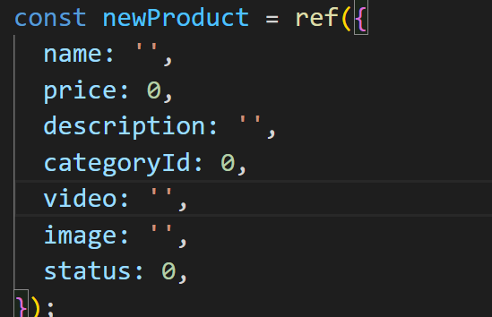
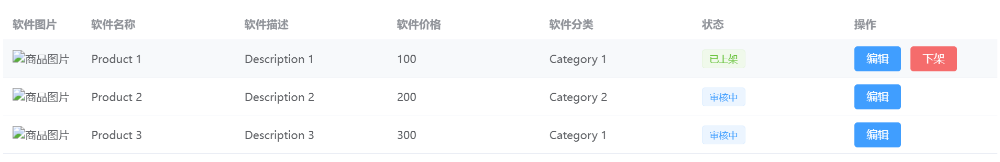
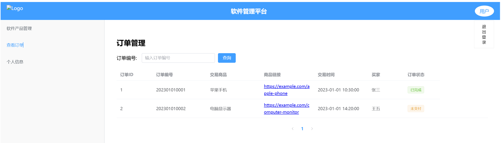
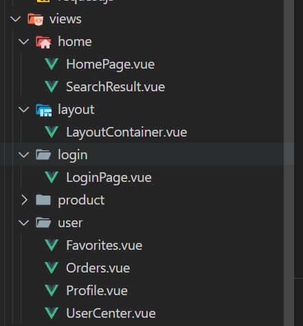
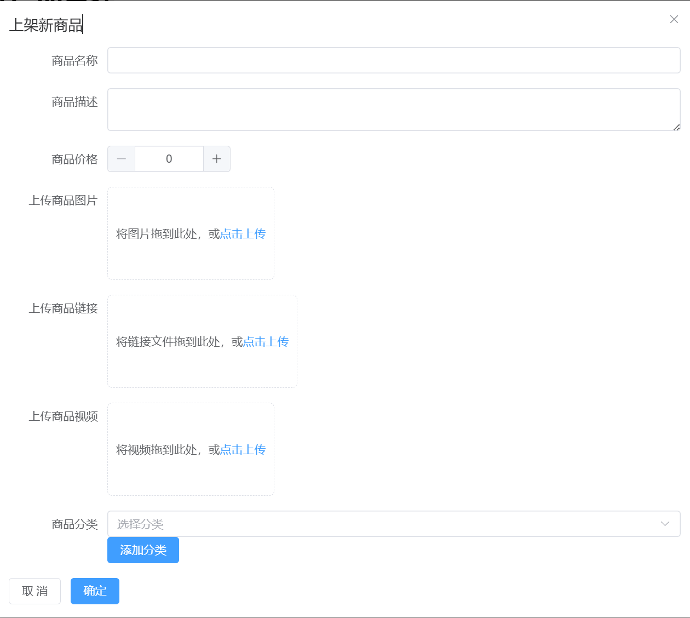
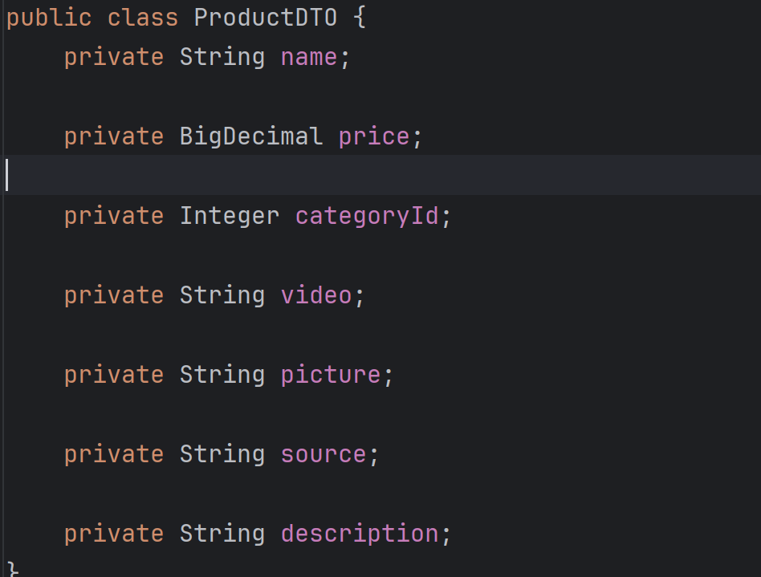

## 商家端

### 逻辑相关

#### 新增商品部分

商家端产品管理部分，前端逻辑：

​	在打开添加商品之后，获取分类表，分类表中包含各个category对象(有id，和name)。在新增商品的页面中，下拉选择category之后，注意显示的是category的name, 但传入给product的实际是id。

  在展示产品的表中 状态要能根据产品的status改变(-1 为审核不通过，0为审核中, 1 为 已上架)

#### 新增分类部分

点击新增分类之后，直接就是新增商品了

### 页面美化相关

​	退出登录做成类似这种

​	

​	可以查看client里面的代码修改

+ 商家端和管理端文件目录结构重新整理，修改完记得修改对应引用文件目录的地方

  类似这种

  

​	

​	

+  

  

​	布局需要美化优化，同时按照以下条目排列

​	

 

